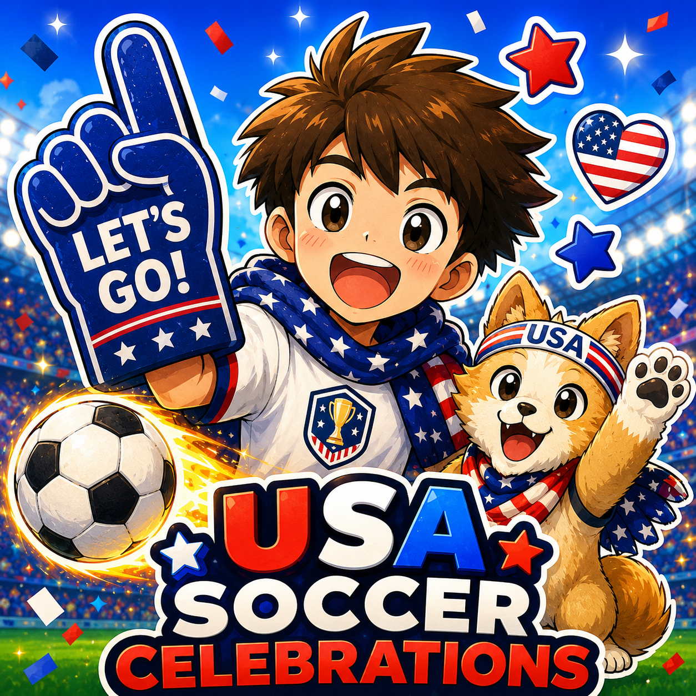

# USA Soccer Celebration Pack

USA Soccer Celebration Pack is an independent fan sticker pack for iMessage. It includes playful USA soccer-inspired stickers for match days, watch parties, goal reactions, celebrations, and everyday fan conversations.



## App Store Metadata

- App name: `USA Soccer Celebration Pack`
- Subtitle: `USA Soccer Fan Stickers`
- App type: iMessage sticker pack
- Website URL: `https://singh-karanpal.github.io/product-assets/index.html`
- Support URL: `https://singh-karanpal.github.io/product-assets/support.html`
- Privacy Policy URL: `https://singh-karanpal.github.io/product-assets/privacy.html`
- App icon: placeholder is stored at [assets/app-icon-placeholder.png](assets/app-icon-placeholder.png); replace with the final exported app icon when ready
- Promotional text: `New stickers added regularly! Celebrate every USA soccer moment with original fan art made for iMessage. No ads, no data collection.`
- What's New for version 1.0: `First release - includes the initial USA soccer fan sticker collection for iMessage.`

## Description

Celebrate USA soccer moments with bold fan stickers made for iMessage.

Cheer on match days.
React to big goals.
Celebrate wins with red-white-blue energy.
Send playful soccer fan art in everyday chats.

USA Soccer Celebration Pack includes playful fan stickers, soccer balls, mascots, celebration reactions, game-day energy, and red-white-blue themed designs you can send in iMessage conversations.

Use them to cheer during matches, react to big goals, celebrate wins, or add some soccer spirit to everyday chats.

## Features

- Fun USA soccer-inspired sticker designs
- Easy to use directly inside Apple Messages for iMessage conversations
- Great for match days, watch parties, and fan conversations
- No account required
- No data collection

## Keywords

```text
soccer,usa,stickers,imessage,fan,goal,celebration,sports,america,futbol,match,chat,world
```

## Independence Disclaimer

This is an independent fan sticker pack and is not affiliated with or endorsed by any soccer federation, team, league, tournament, or player.

## Public Pages

- Website source: [websites](websites)
- Privacy statement source: [websites/privacy.html](websites/privacy.html)
- Support page source: [websites/support.html](websites/support.html)
- Local compatibility copy: [privacy.html](privacy.html) and [support.html](support.html)
- App assets: [assets](assets)
- App legal notes: [legal](legal)
- Changelog: [CHANGELOG.md](CHANGELOG.md)

## Support

- Support contact: `apps.dev.supports@gmail.com`
- Response time: Typically within 48 hours.

## Screenshots

Current screenshots for App Store Connect and the website live in [screenshots](screenshots):

- [imessage-conversation-01-goal-reaction.png](screenshots/imessage-conversation-01-goal-reaction.png)
- [imessage-conversation-02-match-day.png](screenshots/imessage-conversation-02-match-day.png)
- [imessage-conversation-03-celebration.png](screenshots/imessage-conversation-03-celebration.png)
- [imessage-conversation-04-fan-chat.png](screenshots/imessage-conversation-04-fan-chat.png)
- [imessage-conversation-05-watch-party.png](screenshots/imessage-conversation-05-watch-party.png)
- [imessage-conversation-06-victory.png](screenshots/imessage-conversation-06-victory.png)

See [screenshots/README.md](screenshots/README.md) for naming guidance.

## Copyright

Copyright © 2026 Karanpal Singh. All rights reserved.
